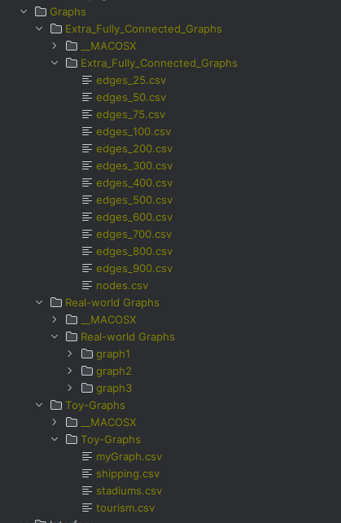

# TSP Solver Tool

## Inputs to reach each point in the program:

- Start Program

- Proceed the application

### 4.1 Backtracking Algorithm [T2.1]

- Calculate TSP with Backtracking Brute Force

### Triangular Approximation Heuristic [T2.2]

- Calculate TSP with Triangular Approximation (Beware that this will make the graph fully connected which may take some time)

### 4.3. Other Heuristics [T2.3]

- Calculate TSP with Nearest Neighbour algorithm (Beware that this will make the graph fully connected which may take some time)

### 4.4. TSP in the Real World [T2.4]

- Calculate TSP for incomplete Graphs

## Post Scriptum:
If you are having troubles with running the project:
1. Make a copy of the dataset folder inside the cmake-build-debug
2. Delete cmake-build-debug
3. Run the program and when prompted with the running error, select the option : "Reload cmake project"
4. Put the graph folders inside the respective folder to match the following picture:

5. Have fun using the program

If you have any trouble loading the csv files, please make sure that the csv files match the attached picture. If you trouble persists, please contact me us:

- [Email](up202207871@up.pt)
- [Email](up202207798@up.pt)
- [Email](up202209739@up.pt)

## Authors

- José Costa - up202207871
- Ângelo Oliveira - up202207798
- Bruno Fortes - up202209739